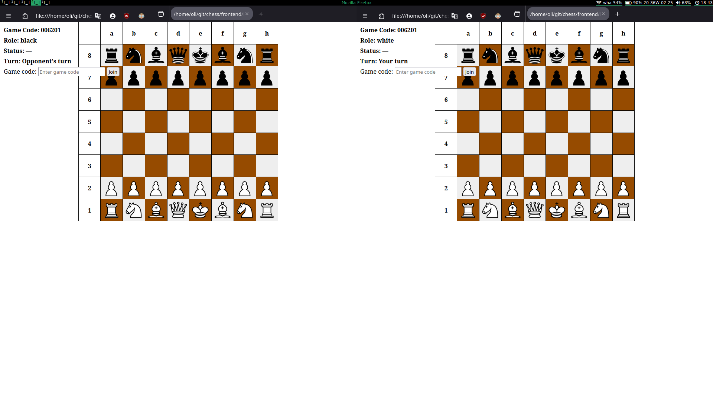
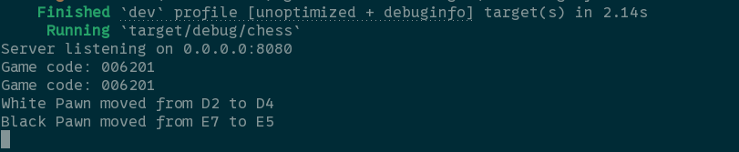

<div align="center">
  <a href="https://apps.apple.com/au/app/recall-reminders/id6746973146">
    <picture>
      <source media="(prefers-color-scheme: dark)" srcset="https://hc-cdn.hel1.your-objectstorage.com/s/v3/e3b397ca96816549ce4b44fcc7a5bfc66b8fd4b4_reminders_app_logo_rounded_corners__1_.png">
      
    </picture>
  </a>

  <h1>Rust Chess App</h1>
  <p><em>A real-time online chess game with a Rust backend and a JavaScript frontend, allowing players to be automatically matched and play against each other in the browser.</em></p>
  

</div>

---

**Rusty Chess** is a *blazingly fast* chess game server that ensures smooth gameplay, real-time matchmaking, and a seamless experience for players across devices.

---

### 📱 Screenshots

<p align="center">
  
  
</p>

---

### ✨ Features

- **Real-time Multiplayer** - Play against opponents from around the world with instant move updates
- **Automatic Matchmaking** - Get paired with another player automatically when you join
- **Complete Chess Rules** - Full implementation including pawn promotion, check, checkmate, stalemate, and draw conditions
- **Game Codes** - Join specific games using unique game codes
- **Role Assignment** - Automatic white/black role assignment for players
- **Responsive Design** - Works seamlessly across desktop and mobile devices
- **Blazingly Fast** - Built with Rust for optimal performance and low latency
- **WebSocket Communication** - Real-time bidirectional communication between players
- **Rematch Support** - Start a new game instantly after finishing

---

### 🚀 Quick Start

#### Download and Run Server

**Linux:**
```bash
curl -L https://github.com/Oliver-Form/chess/releases/latest/download/chess-linux-x86_64 -o chess && chmod +x chess && ./chess
```

**Windows (PowerShell):**
```powershell
Invoke-WebRequest -Uri "https://github.com/Oliver-Form/chess/releases/latest/download/chess-windows-x86_64.exe" -OutFile "chess.exe"; .\chess.exe
```

**macOS (Intel):**
```bash
curl -L https://github.com/Oliver-Form/chess/releases/latest/download/chess-macos-x86_64 -o chess && chmod +x chess && ./chess
```

**macOS (Apple Silicon):**
```bash
curl -L https://github.com/Oliver-Form/chess/releases/latest/download/chess-macos-aarch64 -o chess && chmod +x chess && ./chess
```

#### Setup Frontend (if running locally)

**Linux:**
```bash
curl -L https://raw.githubusercontent.com/Oliver-Form/chess/refs/heads/master/scripts/run-linux.sh -o run-linux.sh && chmod +x run-linux.sh && ./run-linux.sh
```

**Windows (PowerShell):**
```powershell
Invoke-WebRequest -Uri "https://raw.githubusercontent.com/Oliver-Form/chess/refs/heads/master/scripts/run-windows.ps1" -OutFile "run-windows.ps1"; .\run-windows.ps1
```

**macOS:**
```bash
curl -L https://raw.githubusercontent.com/Oliver-Form/chess/refs/heads/master/scripts/run-macos.sh -o run-macos.sh && chmod +x run-macos.sh && ./run-macos.sh
```

These scripts will automatically download the correct binary for your platform, start the server, clone the repo for static assets, and open two browser windows for local multiplayer testing!

